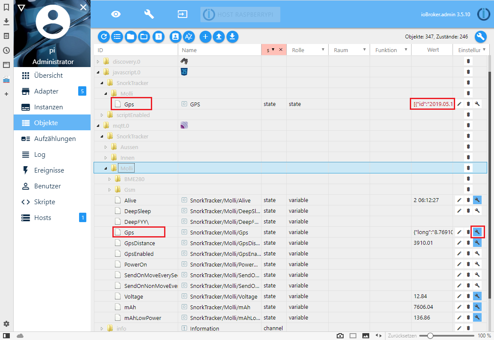

## SnorkView
   **Google map view of the IoBroker SnorkTracker mqtt data.**

   

   **The Adapter.**  
   

   **The MQTT.**  
   

   **The Scripts.**  
   

### Description
   The goal is to have a google map view of the collected SnorkTracker MQTT data.

   The Snorktracker sends at a specific time interval its position to the IoBroker MQTT interface in the form of:
   {"long":"8.650159","lat":"49.414322","alt":" 0","kmph":" 0"}  
   This data is stored via history adapter on disk and can be readed via the simpleApi.
   A simple html page with javascript reads then the collected gps history and shows it on google map.

### Disclaimer
   I don't take any responsibility nor liability for using this software nor for the 
   installation or any tips, advice, videos, etc. given by any member of this site or any related site.

### License
   This program is licensed under GPL-3.0

### Source Code
   **The main html page with the google map view.**  
   SnorkTracker.html

   **Helper script to calculate the bearing of the movement.**  
   global/Bearing.js

   **Helper script to calculate the distance of two gps position.**  
   global/Distance.js

   **Helper script to analyse all the gps history data and transform it to a json package.**  
   global/UpdateGpsData.js

   **Helper script to update the json package when a new gps position received.**  
   Skripte/onSnorkTracker.js

### Prerequisites
   * IoBroker installation (https://www.iobroker.net)
   * Installed Adapter: MQTT Broker/Client
   * Installed Adapter: Script Engine
   * Installed Adapter: Visualisation
   * Installed Adapter: simpleAPI Adapter
   * Installed Adapter: History
   * Installed Adapter: WEB server
   * Open MQTT port over the web

